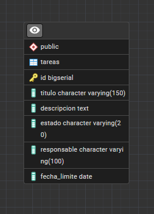
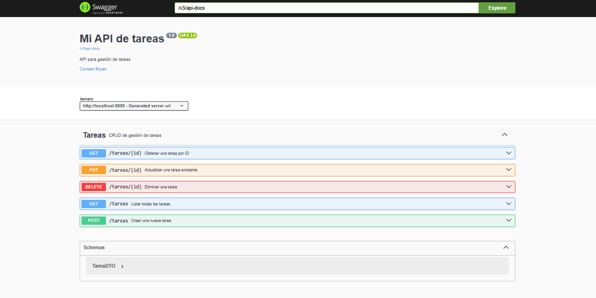
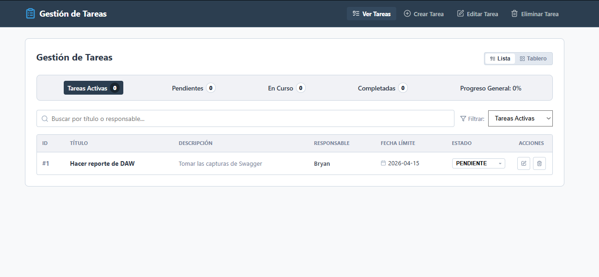
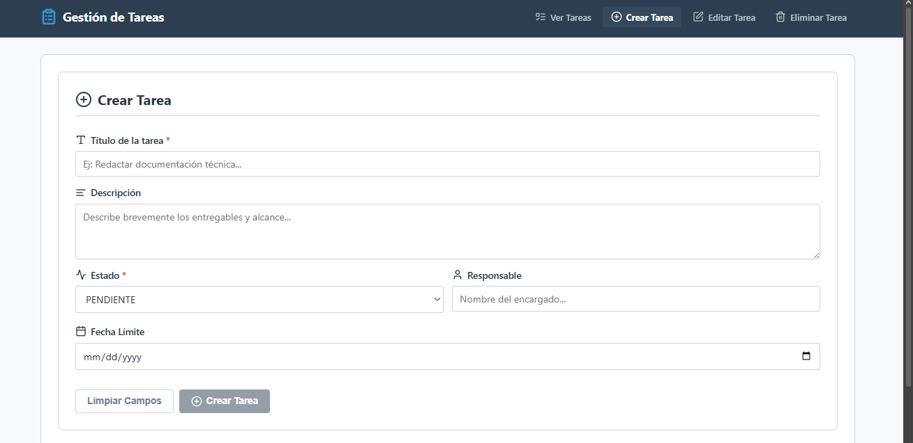
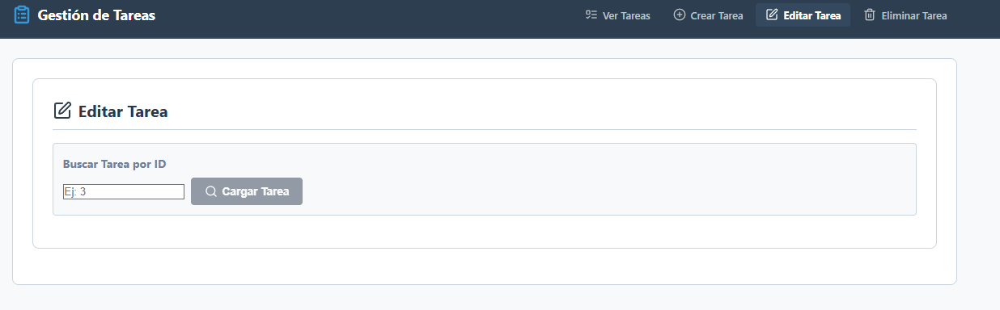
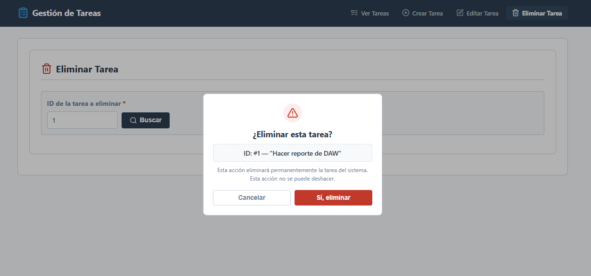

# Gestión de Tareas y Proyectos

## Descripción del Proyecto

Sistema web para la gestión de tareas y proyectos que permite crear, listar, editar y eliminar tareas. Desarrollado con una arquitectura cliente-servidor desacoplada: el backend expone una API REST documentada con Swagger UI, el frontend consume dicha API desde React a través de un proxy inverso Nginx, y todo el sistema se orquesta con Docker Compose mediante tres servicios independientes.

## Integrantes

| Nombre | Carnet |
|--------|--------|
| Ghilmer Eduardo De La Cruz Ventura | DV24003 |
| Bryan Jose Moreno Villanueva | MV24050 |
| Jose Fabricio Reyes Sermeno | RS24033 |
| Juan Jose Recinos Murgas | RM24009 |
| Alan Josue Menendez Hidalgo | MH23001 |

## Repositorio

[https://github.com/pacificador7/Gestion-de-Tareas-y-Proyectos](https://github.com/pacificador7/Gestion-de-Tareas-y-Proyectos)

---

## Diagrama Entidad-Relación



### Script SQL

```sql
CREATE TABLE tareas (
    id          BIGSERIAL PRIMARY KEY,
    titulo      VARCHAR(150) NOT NULL,
    descripcion TEXT,
    estado      VARCHAR(20)  NOT NULL DEFAULT 'PENDIENTE',
    responsable VARCHAR(100),
    fecha_limite DATE
);
```

---

## Estructura del Repositorio

```
Gestion-de-Tareas-y-Proyectos/
├── backend/                  # API REST con Spring Boot
│   ├── src/
│   │   └── main/java/com/daw/gestion_tareas/
│   │       ├── config/       # Configuracion de OpenAPI/Swagger
│   │       ├── controller/   # TareaController (endpoints REST)
│   │       ├── dto/          # TareaDTO (contrato de entrada/salida)
│   │       ├── exception/    # ResourceNotFoundException
│   │       ├── model/        # Entidad JPA Tarea
│   │       ├── repository/   # TareaRepository (Spring Data JPA)
│   │       └── service/      # TareaService (logica de negocio)
│   ├── .dockerignore         # Excluye target/ del contexto Docker
│   └── dockerfile            # Multi-stage: JDK (build) → JRE Alpine (run)
├── frontend/                 # SPA desarrollada en React + Vite
│   ├── src/
│   │   ├── api/              # tareasApi.js (cliente Axios)
│   │   └── components/       # Header, ListadoTareas, CrearTarea, EditarTarea, EliminarTarea
│   ├── nginx.conf            # Configuracion nginx: archivos estaticos + proxy inverso
│   ├── .dockerignore         # Excluye node_modules/ y dist/ del contexto Docker
│   └── dockerfile            # Multi-stage: Node (build) → nginx Alpine (run)
├── database/
│   ├── schema.sql            # Script de creacion de la base de datos
│   └── Diagrama-ER.png
├── docker-compose.yml        # Orquestacion de los tres servicios
└── README.md
```

---

## Tecnologías Utilizadas

### Backend

| Tecnología | Versión |
|------------|---------|
| Java | 21 |
| Spring Boot | 3.5.13 |
| Spring Web | (incluido en Spring Boot) |
| Spring Data JPA | (incluido en Spring Boot) |
| Spring Boot Actuator | (incluido en Spring Boot) |
| Springdoc OpenAPI / Swagger UI | 2.5.0 |
| Lombok | (gestionado por Spring Boot) |
| PostgreSQL Driver | (gestionado por Spring Boot) |

### Frontend

| Tecnología | Versión |
|------------|---------|
| React | 18 |
| Vite | Bundler y servidor de desarrollo |
| Axios | Cliente HTTP |
| Lucide React | Iconografía |
| JavaScript | ES6+ |

### Base de Datos

| Tecnología | Versión |
|------------|---------|
| PostgreSQL | 16 |

### Despliegue

| Herramienta | Rol |
|-------------|-----|
| Docker | Contenerización de servicios |
| Docker Compose | Orquestación de los tres servicios |
| Nginx Alpine | Servidor estático y proxy inverso del frontend |
| Eclipse Temurin JRE 21 Alpine | Imagen de ejecución del backend |
| Node 20 Alpine | Imagen de compilación del frontend (multi-stage build) |

---

## Arquitectura de Despliegue

El sistema se compone de tres contenedores que se comunican a través de una red interna Docker (`app-network`):

```
Navegador
    |
    | :80
    v
[frontend_web]  (nginx:alpine)
    |
    | proxy_pass /tareas -> :8080
    v
[spring_backend]  (eclipse-temurin:21-jre-alpine)
    |
    | JDBC :5432
    v
[postgres_db]  (postgres:16)
```

Los datos de PostgreSQL se persisten en un volumen Docker (`postgres_data`), de modo que no se pierden al detener los contenedores.

El backend expone el endpoint `/actuator/health` y Docker Compose usa un `healthcheck` sobre la base de datos para garantizar el orden correcto de arranque: PostgreSQL debe estar saludable antes de iniciar Spring Boot, y Spring Boot debe estar saludable antes de iniciar nginx.

### Estrategia Multi-stage Build

Tanto el backend como el frontend utilizan **multi-stage builds** en sus Dockerfiles para producir imágenes finales ligeras:

| Servicio | Etapa de construcción | Etapa de ejecución |
|---|---|---|
| Backend | `eclipse-temurin:21-jdk` — compila el JAR con Maven | `eclipse-temurin:21-jre-alpine` — ejecuta el JAR |
| Frontend | `node:20-alpine` — ejecuta `npm run build` | `nginx:alpine` — sirve el directorio `dist/` |

La etapa de construcción se descarta al finalizar. La imagen final no contiene el compilador, el código fuente ni `node_modules`.

---

## API REST

### Base URL

| Entorno | URL |
|---------|-----|
| Docker (producción local) | `http://localhost/tareas` |
| Desarrollo directo (sin Docker) | `http://localhost:8080/tareas` |

### Endpoints

| Método | Endpoint | Descripción | HTTP Status de éxito |
|--------|----------|-------------|----------------------|
| GET | `/tareas` | Listar todas las tareas | 200 OK |
| GET | `/tareas/{id}` | Obtener una tarea por ID | 200 OK |
| POST | `/tareas` | Crear una nueva tarea | 201 Created |
| PUT | `/tareas/{id}` | Actualizar una tarea existente | 200 OK |
| DELETE | `/tareas/{id}` | Eliminar una tarea | 204 No Content |

### Códigos de Estado HTTP

| Código | Descripción | Cuando ocurre |
|--------|-------------|---------------|
| 200 OK | Operación exitosa con cuerpo de respuesta | GET (listar o por ID), PUT |
| 201 Created | Recurso creado exitosamente | POST |
| 204 No Content | Operación exitosa sin cuerpo de respuesta | DELETE |
| 404 Not Found | El recurso solicitado no existe | GET, PUT o DELETE con ID inexistente |
| 500 Internal Server Error | Error inesperado en el servidor | Fallo de conexión u otro error no controlado |

---

## Contrato de la API (TareaDTO)

### Campos del DTO

| Campo | Tipo | Requerido | Descripción |
|-------|------|-----------|-------------|
| `id` | `Long` | Solo lectura | Generado automáticamente por la BD. No enviar en POST ni PUT. |
| `titulo` | `String` | Sí | Máximo 150 caracteres. |
| `descripcion` | `String` | No | Sin límite de longitud (TEXT en BD). |
| `estado` | `String` | Sí | Valores válidos: `PENDIENTE`, `EN_PROGRESO`, `COMPLETADA`. |
| `responsable` | `String` | No | Máximo 100 caracteres. |
| `fechaLimite` | `LocalDate` | No | Formato ISO 8601: `YYYY-MM-DD`. |

### Ejemplo: Cuerpo de entrada (POST / PUT)

```json
{
  "titulo": "Preparar entrega",
  "descripcion": "Documentar avances del laboratorio y subir al repositorio",
  "estado": "PENDIENTE",
  "responsable": "Alan",
  "fechaLimite": "2026-05-30"
}
```

### Ejemplo: Cuerpo de respuesta (GET / POST / PUT)

```json
{
  "id": 1,
  "titulo": "Preparar entrega",
  "descripcion": "Documentar avances del laboratorio y subir al repositorio",
  "estado": "PENDIENTE",
  "responsable": "Alan",
  "fechaLimite": "2026-05-30"
}
```

---

## Evidencias de Funcionamiento

### Swagger UI



### GET — Listar todas las tareas



### POST — Crear una tarea



### PUT — Actualizar una tarea



### DELETE — Eliminar una tarea



---

## Manual de Despliegue con Docker

### Requisitos previos

- Tener instalado [Docker Desktop](https://www.docker.com/products/docker-desktop/)
- Tener el repositorio clonado

> **Nota:** No se requiere tener Java, Node.js ni PostgreSQL instalados en la máquina. Docker provee todo lo necesario dentro de los contenedores.

### Pasos

**1. Clonar el repositorio**

```bash
git clone https://github.com/pacificador7/Gestion-de-Tareas-y-Proyectos.git
cd Gestion-de-Tareas-y-Proyectos
```

**2. Levantar todo el sistema**

```bash
docker compose up --build
```

Este comando construye las imágenes y levanta los tres servicios en el orden correcto (PostgreSQL → Spring Boot → Nginx/React). El flag `--build` fuerza la reconstrucción de las imágenes si el código fuente ha cambiado.

Los tres servicios que se levantan son:

| Servicio | Contenedor | Puerto externo |
|----------|------------|----------------|
| Base de datos (PostgreSQL 16) | `postgres_db` | `5432` |
| Backend (Spring Boot) | `spring_backend` | `8080` |
| Frontend (React + Nginx) | `frontend_web` | `80` |

**3. Acceder a la aplicación**

| Servicio | URL |
|----------|-----|
| Frontend | http://localhost |
| Backend API | http://localhost:8080/tareas |
| Swagger UI | http://localhost:8080/swagger-ui/index.html |
| Actuator Health | http://localhost:8080/actuator/health |

**4. Detener el sistema**

```bash
docker compose down
```

Para detener y además eliminar el volumen de datos de PostgreSQL:

```bash
docker compose down -v
```

### Variables de entorno

La conexión a la base de datos se configura mediante variables de entorno con valores por defecto. El archivo `application.properties` usa la sintaxis `${VARIABLE:valor_por_defecto}`:

| Variable | Valor en Docker | Valor por defecto (local) |
|---|---|---|
| `DB_HOST` | `db` (nombre del servicio) | `localhost` |
| `DB_NAME` | `tareas_db` | `tareas_db` |
| `DB_USER` | `postgres` | `postgres` |
| `DB_PASSWORD` | `postgres` | `postgres` |

Esto permite que el mismo código funcione tanto en Docker como en desarrollo local sin modificaciones.

### Limpieza previa (si existen contenedores de versiones anteriores)

```bash
docker compose down -v
docker system prune
git pull origin main
docker compose up --build
```

---

## Ejecución sin Docker (desarrollo local)

### Requisitos

- Java 21
- Maven (o usar el wrapper incluido `mvnw`)
- Node.js 20+
- PostgreSQL corriendo localmente en el puerto `5432` con base de datos `tareas_db`

### Backend

```bash
cd backend
./mvnw spring-boot:run
```

El backend queda disponible en `http://localhost:8080`.

Si la contraseña de PostgreSQL local es diferente a `postgres`, crear el archivo `backend/src/main/resources/application-local.properties`:

```properties
spring.datasource.password=tu_contraseña
```

Y arrancar con:

```bash
./mvnw spring-boot:run -Dspring-boot.run.profiles=local
```

### Frontend

```bash
cd frontend
npm install
npm run dev
```

El frontend queda disponible en `http://localhost:5173`. Vite está configurado con un proxy que redirige `/tareas` a `http://localhost:8080/tareas`.

---

## Licencia

Uso académico — Desarrollo de Aplicaciones Web (DAW), Universidad de El Salvador.
